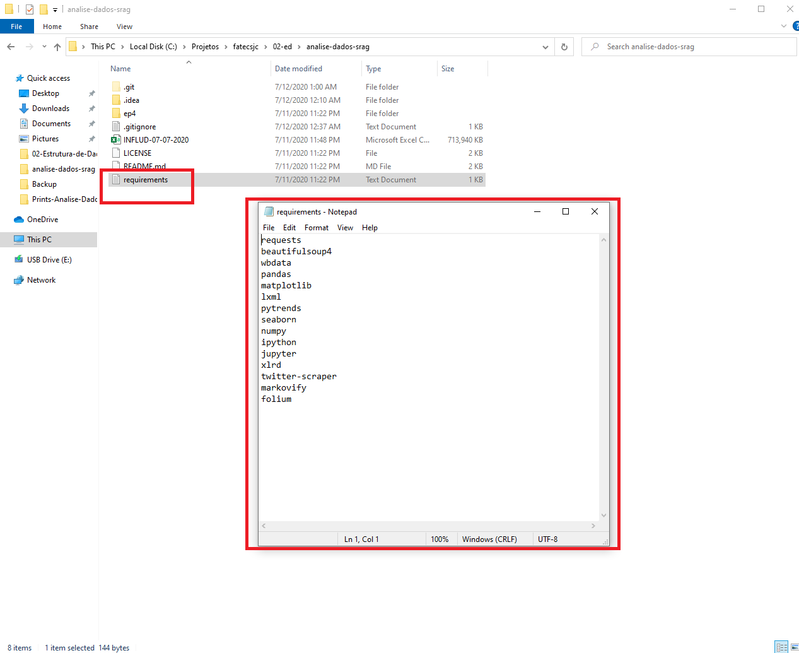
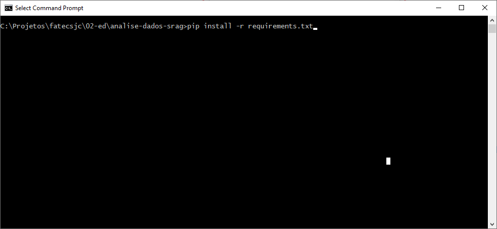
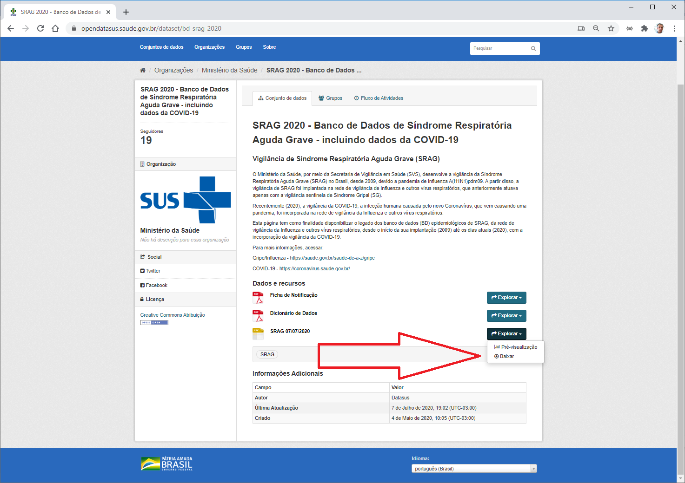
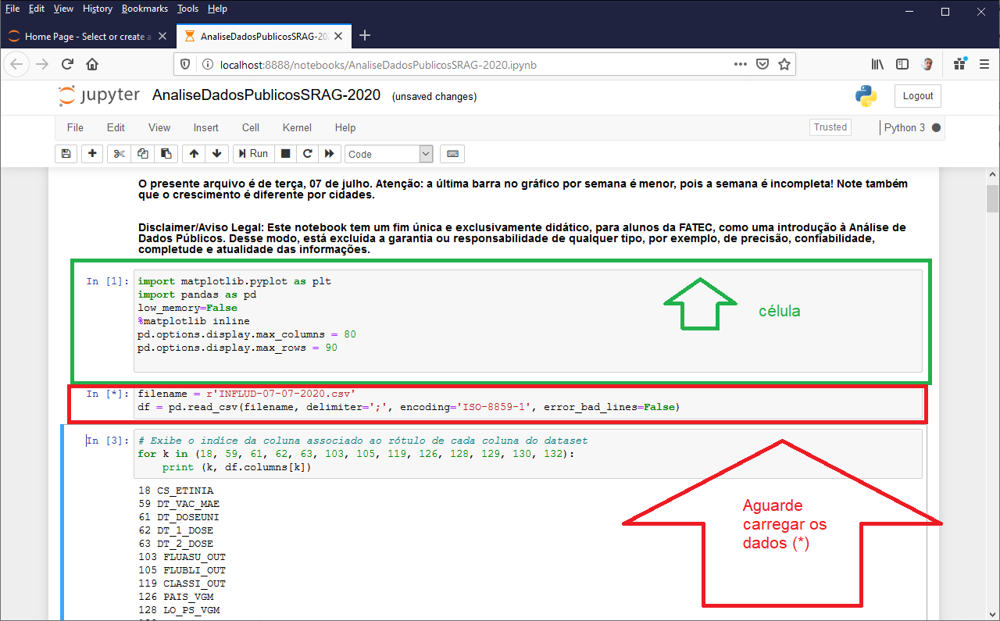

# **Analise de Dados Publicos : Sindrome Respiratória Aguda Grave**

## Este projeto é uma atividade (EP4) para a disciplina Estrutura de Dados do Curso de Tecnologia em Banco de Dados

#### Os dados, até a data do presente estudo, estão no [opendatasus.saude.gov.br](https://opendatasus.saude.gov.br/dataset/bd-srag-2020).
#### O presente arquivo é de terça, 07 de julho. Atenção: a última barra no gráfico por semana é menor, pois a semana é incompleta! Note também que o crescimento é diferente por cidades.
#### Disclaimer/Aviso Legal: Este notebook tem um fim única e exclusivamente didático, para alunos da FATEC, como uma introdução à Análise de Dados Públicos. Desse modo, está excluída a garantia ou responsabilidade de qualquer tipo, por exemplo, de precisão, confiabilidade, completude e atualidade das informações.

### **FATEC SJC - Professor Jessen Vidal**
### **Professor:** Fernando Masanori Ashicaga
### **Disciplina:** Estrutura de Dados
### **Aluno:** Robson de Sousa

Para executar esse projeto em sua máquina você irá precisar...

Passo 1 - Clonar o projeto

git clone https://github.com/robsoncartes/analise-dados-srag

Instalar e Configurar o Ambiente

Windows

Passo 2 - Instalar e Configurar o Python

Acessar o site oficial do Python em https://www.python.org/

Baixar a versão de acordo com a arquitetura e versão do seu sistema operacional.
Faça a Instalação

Configurar variáveis de ambiente

Lembre-se de que no momento da instalação do Python, você deve escolher a versão 3.6 ou superior, marcar a caixa de diálogo “Adicionar PATH as variáveis de ambiente” para que a chamada de execução do Python possa ser feita a partir de qualquer diretório.

Atualização do PIP (esse conjunto de comandos é opcional): python -m pip install --upgrade pip

Crie um arquivo de texto denominado requirements.txt, caso este não exista.

Este arquivo deve conter as bibliotecas auxiliares e dependências do projeto, necessárias para a realização desse laboratório.
Nesse laboratório de exemplo adicionaremos as seguintes bibliotecas ao arquivo “requirements.txt”: requests, beautifulsoup4, wbdata, pandas, matplotlib, lxml, pytrends, seaborn, numpy, ipython, jupyter, xlrd, twitter-scraper, markovify, folium.

Observação: não iremos utilizar todas as bibliotecas, mas é bom tê-las desde já, para uso futuro.

Abra o terminal no diretório raiz do projeto e execute o seguinte comando: 

**pip install -r requirements.txt**

Veja o exemplo a seguir:

Passo 3 – Baixar o Dataset do Sistema OPENDATASUS

Fonte: https://opendatasus.saude.gov.br/dataset/bd-srag-2020

Como forma alternativa é possível baixar o dataset diretamente através do link a seguir:

https://s3-sa-east-1.amazonaws.com/ckan.saude.gov.br/SRAG/2020/INFLUD-07-07-2020.csv

Após baixar o arquivo (Dataset) opcionalmente você pode colocá-lo na raiz do projeto. Suponha que o nome do seu projeto seja “analise_de_dados_publicos” e que este projeto esteja no diretório “C:\projetos”. Assim temos, “C:\projetos\ analise_de_dados_publicos”. Então o dataset de nome “INFLUD-dia-mes-ano.csv”, onde dia, mês e ano representam a data do arquivo mais recente, por exemplo, “INFLUD-07-07-2020.csv” e este deve estar dentro de “analise_de_dados_publicos” e ficaria assim: “C:\projetos\ analise_de_dados_publicos\ INFLUD-dia-mes-ano.csv” Entretanto você pode criar tanto o projeto no diretório que preferir, quanto salvar o Dataset em outro local, desde claro, que o caminho para o arquivo seja válido e que a aplicação seja capaz de lê-lo a partir do caminho que você informou.

Observação: caro queira recriar e modificar o experimento e caso queira subir os arquivos para o Github ou qualquer outro repositório de código e caso tenha o arquivo “INFLUD-dia-mes-ano.csv” na raiz do seu projeto, lembre-se de adicionar este arquivo ao arquivo “. gitignore”. Isso é importante, pois o tamanho do arquivo excede o tamanho de arquivo permitido para envio para o Github.

Passo 4 - Executar o no CMD ou terminal bash o seguinte comando:

jupyter notebook

Passo 5 - Acessar o a url do projeto

Após executar o comando **jupyter notebook** note que irá abrir um guia no navegador.

Navegue até o arquivo **AnaliseDadosPublicosSRAG-2020.ipynb**.

Execute as células. 
Pressione e mantenha pressionado a tecla Shift e pressione ENTER dentro de cada célula do projeto.

